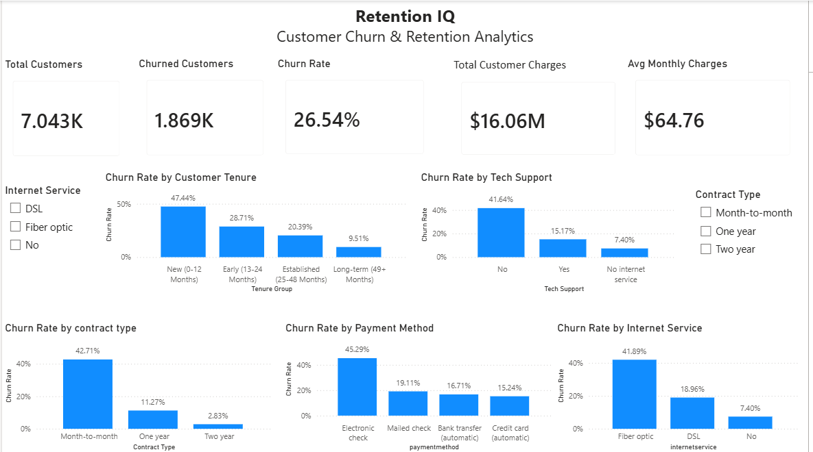
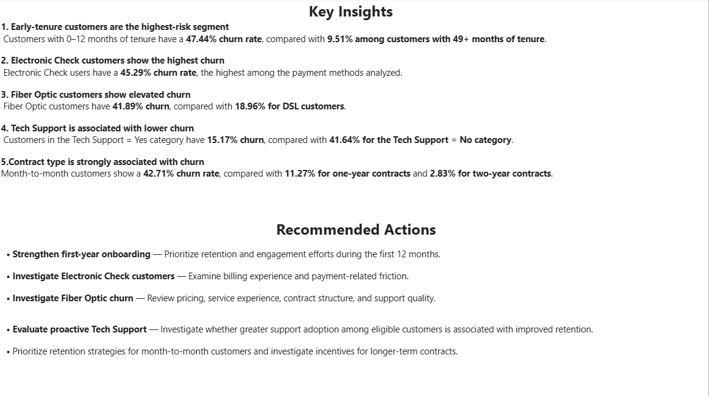

# RetentionIQ — Customer Churn & Retention Analytics

## Project Overview

RetentionIQ is a customer churn analysis project created to understand customer churn patterns and identify customer segments with higher observed churn.

The project uses SQL for data analysis and Power BI to build an interactive dashboard for tracking churn and comparing different customer segments.

## Business Objective

The main objective was to analyze customer churn and identify the customer groups with higher churn rates so that businesses can focus their retention efforts on these segments.

## Tools Used

- PostgreSQL
- SQL
- Power BI
- DAX

## Key KPIs

| KPI | Value |
|---|---:|
| Total Customers | 7,043 |
| Churned Customers | 1,869 |
| Overall Churn Rate | 26.54% |
| Total Customer Charges | $16.06M |
| Average Monthly Charges | $64.76 |

## Key Insights

### 1. Early-tenure customers have the highest churn

Customers with 0–12 months of tenure have a **47.44% churn rate**, compared with **9.51%** among customers with 49+ months of tenure.

### 2. Electronic Check customers show the highest churn

Electronic Check users have a **45.29% churn rate**, the highest among the payment methods analyzed.

### 3. Fiber Optic customers show elevated churn

Fiber Optic customers have a **41.89% churn rate**, compared with **18.96%** for DSL customers.

### 4. Tech Support is associated with lower churn

Customers with Tech Support have a **15.17% churn rate**, compared with **41.64%** among customers without Tech Support.

### 5. Contract type is strongly associated with churn

Month-to-month customers have a **42.71% churn rate**, compared with **11.27%** for one-year contracts and **2.83%** for two-year contracts.

## Recommendations

- Focus onboarding and engagement efforts on customers during their first 12 months.
- Investigate billing and payment-related issues among Electronic Check users.
- Investigate factors contributing to the higher churn observed among Fiber Optic customers.
- Evaluate proactive Tech Support adoption among eligible customers.
- Develop targeted retention strategies for month-to-month customers.

## Dashboard

### Executive Dashboard



### Insights & Recommendations



## Project Structure

```text
RetentionIQ-Customer-Churn-Analytics/
│
├── README.md
├── churn_analysis.sql
├── RetentionIQ_Customer_Churn_Analytics.pbix
├── dashboard.png
└── insights.png
